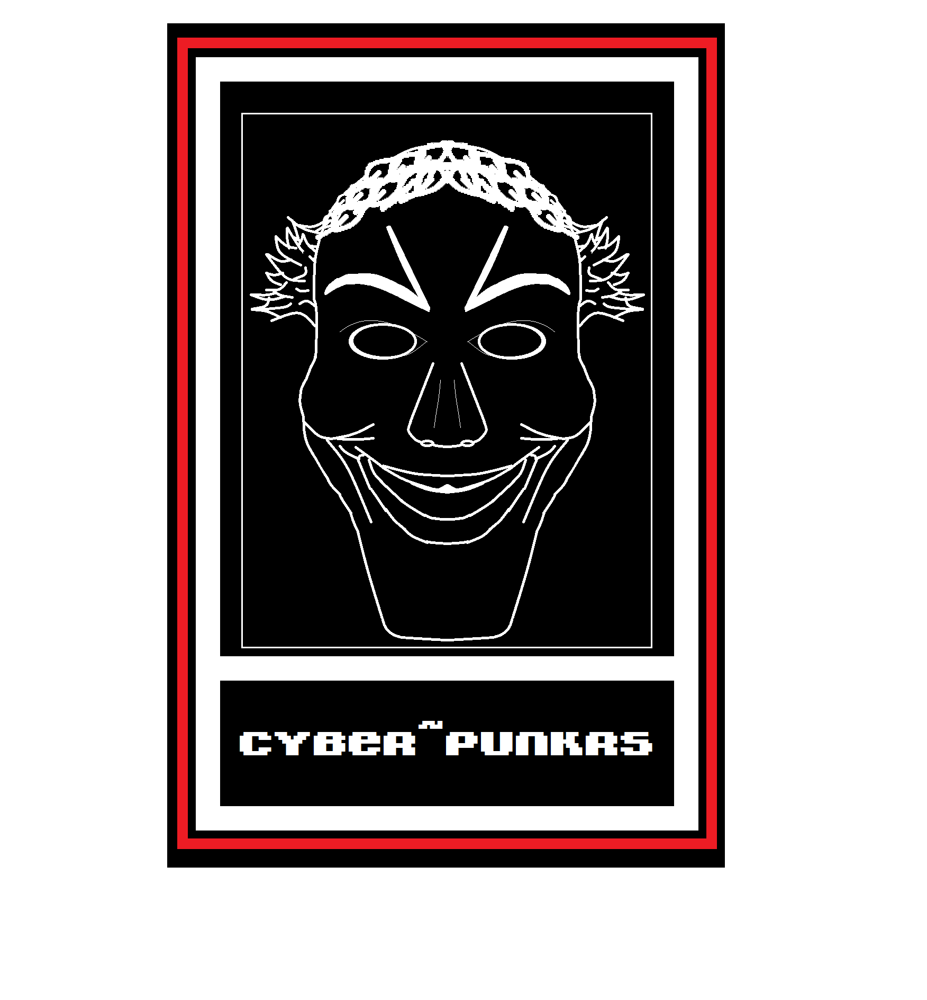

# `cyWiki`

Um compilado de informações sobre programação, hacking, criptografia, privacidade, cultura cyberpunk, etc.
Essa ramificação do projeto tem o intuíto de centralizar as informações técnicas que são abordadas entre os membros. Facilitando os meios de estudo e ajudando os iniciantes a seguirem um caminho já trilhado.

----

### tl;dr

  > *Se você tem alguma dúvida ou sugestão, abra um* [issue](https://github.com/Cyberpunkrs/cyWiki/blob/dev/wiki_tags.md)

  > *Se você está buscando algum material relacionado aos tópicos, visite nossa* [wiki](https://github.com/Cyberpunkrs/cyWiki/wiki)

### Issues

  Issues podem ser uma questão, uma lista de links sobre algum tópico ou uma sugestão para a comunidade. Sinta-se a vontade para abrir um novo issue se quiser.

 ----

 ### Wiki

   A wiki é composta por material de nosso grupo e canal do telegram, os issues abertos e material mais específico que não foi postado em nenhum dos outros dois, compilado e organizado.

   Apenas admins podem modificar a wiki, então sugiro que a visite: [wiki](https://github.com/Cyberpunkrs/cyWiki/wiki)
   
   Os tópicos da wiki devem seguir esse [modelo](https://github.com/Cyberpunkrs/cyWiki/blob/dev/topic_schema.md)
